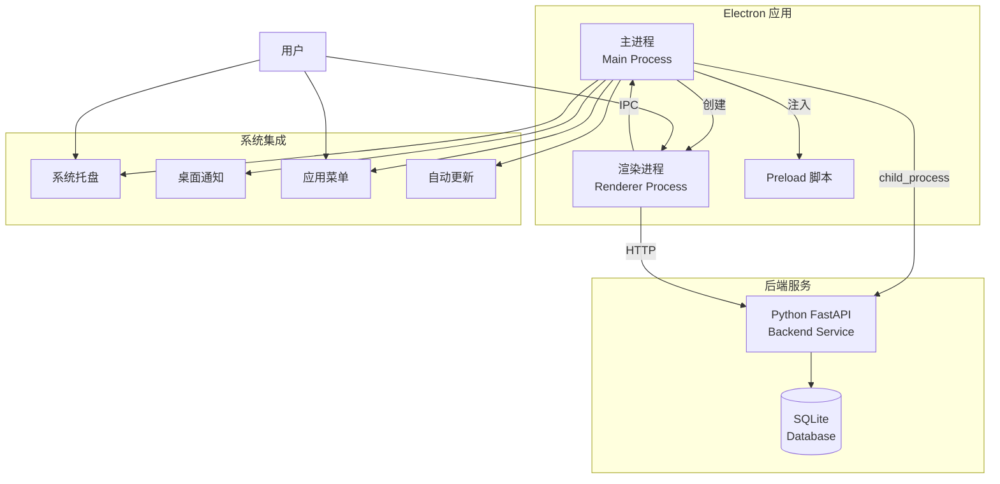
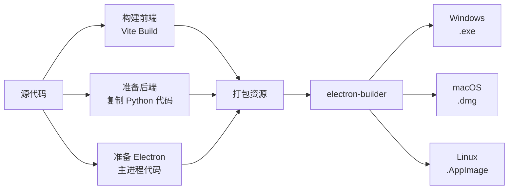

# 设计文档：Electron 桌面应用

## 概述

本设计文档描述如何将量数风行 Web 应用封装成 Electron 桌面应用。应用采用 Electron 多进程架构，主进程负责窗口管理和系统集成，渲染进程运行 React 应用，内置 Python 后端服务通过子进程启动。应用支持 Windows、macOS、Linux 三个平台，提供系统托盘、桌面通知、自动更新等原生功能。

### 设计目标

1. **无缝集成**：复用现有 React 前端代码，最小化改动
2. **一键启动**：自动启动前后端服务，用户无需手动操作
3. **原生体验**：提供系统托盘、通知、快捷键等原生功能
4. **跨平台**：支持 Windows、macOS、Linux 三个平台
5. **安全可靠**：进程隔离、安全通信、错误恢复

## 架构

### 整体架构



### 进程模型

1. **主进程（Main Process）**
   - 职责：窗口管理、系统集成、后端服务管理
   - 技术：Node.js + Electron API
   - 文件：`electron/main.js`

2. **渲染进程（Renderer Process）**
   - 职责：运行 React Web 应用
   - 技术：React + TypeScript + Vite
   - 文件：现有 `src/` 目录

3. **Preload 脚本**
   - 职责：安全桥接主进程和渲染进程
   - 技术：Node.js（受限环境）
   - 文件：`electron/preload.js`

4. **后端服务（子进程）**
   - 职责：提供 API 服务
   - 技术：Python + FastAPI
   - 文件：现有 `backend/` 目录

### 目录结构

```
project/
├── electron/                 # Electron 相关代码
│   ├── main.js              # 主进程入口
│   ├── preload.js           # Preload 脚本
│   ├── backend-manager.js   # 后端服务管理器
│   ├── tray-manager.js      # 系统托盘管理器
│   ├── window-manager.js    # 窗口管理器
│   ├── updater.js           # 自动更新模块
│   ├── menu.js              # 应用菜单
│   └── logger.js            # 日志模块
├── src/                     # React 前端（现有）
├── backend/                 # Python 后端（现有）
├── resources/               # 应用资源
│   ├── icon.png            # 应用图标
│   ├── icon.ico            # Windows 图标
│   └── icon.icns           # macOS 图标
├── build/                   # 构建输出
├── package.json            # 项目配置
└── electron-builder.yml    # 打包配置
```

## 组件和接口

### 1. 主进程（Main Process）

**职责**：
- 创建和管理应用窗口
- 启动和管理后端服务
- 处理系统集成（托盘、通知、菜单）
- 管理应用生命周期

**接口**：

```typescript
// electron/main.js

interface MainProcessConfig {
  windowWidth: number;
  windowHeight: number;
  minWidth: number;
  minHeight: number;
  backendPort: number;
  backendStartupTimeout: number;
}

class MainProcess {
  // 初始化应用
  initialize(): void;
  
  // 创建主窗口
  createMainWindow(): BrowserWindow;
  
  // 启动后端服务
  startBackendService(): Promise<void>;
  
  // 停止后端服务
  stopBackendService(): Promise<void>;
  
  // 处理应用退出
  handleAppQuit(): void;
}
```

**实现要点**：
- 使用 `app.whenReady()` 等待 Electron 初始化
- 使用 `BrowserWindow` 创建窗口
- 配置安全选项：`contextIsolation: true`, `nodeIntegration: false`
- 注册 IPC 处理器
- 处理 `window-all-closed` 和 `activate` 事件

### 2. 后端服务管理器（Backend Manager）

**职责**：
- 启动 Python 后端服务子进程
- 检测服务就绪状态
- 监控服务健康状态
- 处理服务崩溃和重启

**接口**：

```typescript
// electron/backend-manager.js

interface BackendConfig {
  pythonPath: string;        // Python 可执行文件路径
  backendScript: string;     // 后端启动脚本路径
  port: number;              // 后端服务端口
  host: string;              // 后端服务主机（127.0.0.1）
  startupTimeout: number;    // 启动超时时间（毫秒）
  maxRestartAttempts: number; // 最大重启次数
}

class BackendManager {
  // 启动后端服务
  start(config: BackendConfig): Promise<void>;
  
  // 停止后端服务
  stop(): Promise<void>;
  
  // 检查服务是否就绪
  isReady(): Promise<boolean>;
  
  // 获取服务状态
  getStatus(): BackendStatus;
  
  // 重启服务
  restart(): Promise<void>;
  
  // 监听服务输出
  onOutput(callback: (data: string) => void): void;
  
  // 监听服务错误
  onError(callback: (error: Error) => void): void;
}

enum BackendStatus {
  STOPPED = 'stopped',
  STARTING = 'starting',
  RUNNING = 'running',
  ERROR = 'error'
}
```

**实现要点**：
- 使用 `child_process.spawn()` 启动 Python 进程
- 使用 `axios` 或 `fetch` 轮询健康检查端点（`/health`）
- 捕获 stdout/stderr 并写入日志
- 监听进程 `exit` 事件，实现自动重启
- 在 Windows 上使用 `pythonw.exe` 避免控制台窗口
- 打包时使用 PyInstaller 或嵌入式 Python

### 3. 窗口管理器（Window Manager）

**职责**：
- 管理窗口状态（位置、大小、全屏）
- 持久化窗口状态
- 恢复窗口状态
- 处理窗口事件

**接口**：

```typescript
// electron/window-manager.js

interface WindowState {
  x: number;
  y: number;
  width: number;
  height: number;
  isMaximized: boolean;
  isFullScreen: boolean;
}

class WindowManager {
  // 创建窗口并恢复状态
  createWindow(options: BrowserWindowConstructorOptions): BrowserWindow;
  
  // 保存窗口状态
  saveWindowState(window: BrowserWindow): void;
  
  // 加载窗口状态
  loadWindowState(): WindowState | null;
  
  // 重置窗口状态
  resetWindowState(): void;
  
  // 监听窗口状态变化
  watchWindowState(window: BrowserWindow): void;
}
```

**实现要点**：
- 使用 `electron-store` 持久化窗口状态
- 监听 `resize`, `move`, `maximize`, `unmaximize` 事件
- 使用防抖（debounce）避免频繁保存
- 验证窗口位置在屏幕范围内
- 处理多显示器场景

### 4. 系统托盘管理器（Tray Manager）

**职责**：
- 创建系统托盘图标
- 管理托盘菜单
- 处理托盘事件

**接口**：

```typescript
// electron/tray-manager.js

interface TrayConfig {
  iconPath: string;
  tooltip: string;
}

class TrayManager {
  // 创建托盘图标
  create(config: TrayConfig, window: BrowserWindow): Tray;
  
  // 更新托盘图标
  updateIcon(iconPath: string): void;
  
  // 更新工具提示
  updateTooltip(tooltip: string): void;
  
  // 显示/隐藏窗口
  toggleWindow(): void;
  
  // 销毁托盘
  destroy(): void;
}
```

**实现要点**：
- 使用 `Tray` 类创建托盘图标
- 提供不同平台的图标（Windows: .ico, macOS: .png, Linux: .png）
- 托盘菜单包含：显示/隐藏、退出
- 单击托盘图标切换窗口显示状态
- 右键显示上下文菜单

### 5. Preload 脚本

**职责**：
- 安全暴露主进程 API 给渲染进程
- 提供 IPC 通信桥接

**接口**：

```typescript
// electron/preload.js

interface ElectronAPI {
  // 发送消息到主进程
  send(channel: string, data: any): void;
  
  // 接收主进程消息
  on(channel: string, callback: (data: any) => void): void;
  
  // 移除监听器
  removeListener(channel: string, callback: Function): void;
  
  // 获取应用版本
  getAppVersion(): string;
  
  // 获取平台信息
  getPlatform(): string;
  
  // 打开外部链接
  openExternal(url: string): void;
  
  // 显示通知
  showNotification(title: string, body: string): void;
}

// 暴露到 window.electronAPI
contextBridge.exposeInMainWorld('electronAPI', electronAPI);
```

**实现要点**：
- 使用 `contextBridge.exposeInMainWorld()` 安全暴露 API
- 使用 `ipcRenderer` 进行 IPC 通信
- 验证所有 IPC 消息的来源和格式
- 不直接暴露 Node.js 或 Electron API

### 6. 自动更新模块（Updater）

**职责**：
- 检查应用更新
- 下载更新包
- 安装更新

**接口**：

```typescript
// electron/updater.js

interface UpdateInfo {
  version: string;
  releaseDate: string;
  releaseNotes: string;
  downloadUrl: string;
}

class Updater {
  // 检查更新
  checkForUpdates(): Promise<UpdateInfo | null>;
  
  // 下载更新
  downloadUpdate(info: UpdateInfo): Promise<void>;
  
  // 安装更新并重启
  installUpdate(): void;
  
  // 监听下载进度
  onDownloadProgress(callback: (progress: number) => void): void;
  
  // 监听更新事件
  onUpdateAvailable(callback: (info: UpdateInfo) => void): void;
  onUpdateDownloaded(callback: () => void): void;
  onUpdateError(callback: (error: Error) => void): void;
}
```

**实现要点**：
- 使用 `electron-updater` 库
- 配置更新服务器（GitHub Releases 或自建服务器）
- 支持增量更新（差分更新）
- 显示更新对话框和进度
- 支持静默更新选项

### 7. 应用菜单（Menu）

**职责**：
- 创建原生应用菜单
- 处理菜单操作

**接口**：

```typescript
// electron/menu.js

interface MenuTemplate {
  label: string;
  submenu?: MenuItemConstructorOptions[];
  role?: string;
  accelerator?: string;
  click?: () => void;
}

class MenuBuilder {
  // 构建菜单
  buildMenu(window: BrowserWindow): Menu;
  
  // 获取菜单模板
  getMenuTemplate(): MenuTemplate[];
  
  // 设置应用菜单
  setApplicationMenu(menu: Menu): void;
}
```

**实现要点**：
- 使用 `Menu.buildFromTemplate()` 创建菜单
- 根据平台调整菜单结构（macOS 应用菜单在顶部）
- 菜单项包含：
  - 文件：刷新、设置、退出
  - 编辑：撤销、重做、剪切、复制、粘贴
  - 视图：重新加载、开发者工具、全屏
  - 窗口：最小化、关闭
  - 帮助：关于、文档
- 使用 `accelerator` 定义快捷键

### 8. 日志模块（Logger）

**职责**：
- 记录应用日志
- 管理日志文件
- 提供日志查询

**接口**：

```typescript
// electron/logger.js

enum LogLevel {
  DEBUG = 'debug',
  INFO = 'info',
  WARN = 'warn',
  ERROR = 'error'
}

class Logger {
  // 记录日志
  log(level: LogLevel, message: string, meta?: any): void;
  
  // 便捷方法
  debug(message: string, meta?: any): void;
  info(message: string, meta?: any): void;
  warn(message: string, meta?: any): void;
  error(message: string, meta?: any): void;
  
  // 获取日志文件路径
  getLogPath(): string;
  
  // 清理旧日志
  cleanOldLogs(daysToKeep: number): void;
}
```

**实现要点**：
- 使用 `electron-log` 库
- 日志文件存储在 `app.getPath('logs')`
- 日志格式：`[时间] [级别] [消息] [元数据]`
- 自动轮转日志文件（按大小或日期）
- 在开发模式下同时输出到控制台

## 数据模型

### 1. 应用配置

```typescript
interface AppConfig {
  // 窗口配置
  window: {
    width: number;
    height: number;
    minWidth: number;
    minHeight: number;
    x?: number;
    y?: number;
    isMaximized: boolean;
    isFullScreen: boolean;
  };
  
  // 后端配置
  backend: {
    port: number;
    host: string;
    startupTimeout: number;
    autoRestart: boolean;
    maxRestartAttempts: number;
  };
  
  // 更新配置
  updater: {
    autoCheck: boolean;
    autoDownload: boolean;
    checkInterval: number; // 小时
  };
  
  // 通知配置
  notifications: {
    enabled: boolean;
    sound: boolean;
  };
  
  // 托盘配置
  tray: {
    enabled: boolean;
    minimizeToTray: boolean;
    closeToTray: boolean;
  };
  
  // 开发配置
  development: {
    devTools: boolean;
    hotReload: boolean;
  };
}
```

### 2. IPC 消息格式

```typescript
// 渲染进程 -> 主进程
interface IPCRequest {
  channel: string;
  data: any;
  requestId?: string;
}

// 主进程 -> 渲染进程
interface IPCResponse {
  channel: string;
  data: any;
  requestId?: string;
  error?: string;
}

// IPC 通道定义
enum IPCChannel {
  // 窗口操作
  WINDOW_MINIMIZE = 'window:minimize',
  WINDOW_MAXIMIZE = 'window:maximize',
  WINDOW_CLOSE = 'window:close',
  WINDOW_FULLSCREEN = 'window:fullscreen',
  
  // 后端服务
  BACKEND_STATUS = 'backend:status',
  BACKEND_RESTART = 'backend:restart',
  BACKEND_LOGS = 'backend:logs',
  
  // 通知
  SHOW_NOTIFICATION = 'notification:show',
  
  // 更新
  CHECK_UPDATE = 'update:check',
  DOWNLOAD_UPDATE = 'update:download',
  INSTALL_UPDATE = 'update:install',
  UPDATE_PROGRESS = 'update:progress',
  
  // 应用信息
  GET_APP_VERSION = 'app:version',
  GET_APP_PATH = 'app:path',
  OPEN_EXTERNAL = 'app:open-external',
  OPEN_LOG_FOLDER = 'app:open-log-folder',
}
```

### 3. 后端服务状态

```typescript
interface BackendServiceState {
  status: 'stopped' | 'starting' | 'running' | 'error';
  port: number;
  pid?: number;
  startTime?: Date;
  restartCount: number;
  lastError?: string;
  healthCheckUrl: string;
}
```

## 打包和分发

### 1. electron-builder 配置

```yaml
# electron-builder.yml
appId: com.quantdata.fengxing
productName: 量数风行
copyright: Copyright © 2024

directories:
  output: dist
  buildResources: resources

files:
  - electron/**/*
  - dist-frontend/**/*  # Vite 构建输出
  - backend/**/*
  - resources/**/*
  - package.json

extraResources:
  - from: backend
    to: backend
    filter:
      - "**/*"
      - "!**/__pycache__"
      - "!**/*.pyc"
  - from: python-runtime  # 嵌入式 Python
    to: python-runtime

win:
  target:
    - nsis
  icon: resources/icon.ico
  artifactName: ${productName}-${version}-win-${arch}.${ext}

mac:
  target:
    - dmg
  icon: resources/icon.icns
  category: public.app-category.finance
  hardenedRuntime: true
  gatekeeperAssess: false
  entitlements: build/entitlements.mac.plist
  entitlementsInherit: build/entitlements.mac.plist

linux:
  target:
    - AppImage
  icon: resources/icon.png
  category: Finance
  artifactName: ${productName}-${version}-linux-${arch}.${ext}

nsis:
  oneClick: false
  allowToChangeInstallationDirectory: true
  createDesktopShortcut: true
  createStartMenuShortcut: true
  shortcutName: ${productName}

dmg:
  title: ${productName} ${version}
  icon: resources/icon.icns
  contents:
    - x: 410
      y: 150
      type: link
      path: /Applications
    - x: 130
      y: 150
      type: file

publish:
  provider: github
  owner: your-org
  repo: your-repo
```

### 2. 构建流程



**构建步骤**：

1. **前端构建**：
   ```bash
   npm run build  # Vite 构建 React 应用
   ```

2. **后端准备**：
   - 选项 A：复制 Python 源代码 + 嵌入式 Python 运行时
   - 选项 B：使用 PyInstaller 打包成可执行文件

3. **Electron 打包**：
   ```bash
   npm run electron:build  # electron-builder 打包
   ```

4. **代码签名**（可选）：
   - Windows: 使用 Authenticode 签名
   - macOS: 使用 Apple Developer 证书签名
   - Linux: 不需要签名

### 3. Python 运行时集成

**方案 A：嵌入式 Python**

优点：
- 完全控制 Python 环境
- 无需用户安装 Python
- 依赖隔离

缺点：
- 安装包较大（~100MB）
- 需要为每个平台准备 Python 运行时

实现：
```javascript
// electron/backend-manager.js
const pythonPath = path.join(
  process.resourcesPath,
  'python-runtime',
  process.platform === 'win32' ? 'python.exe' : 'bin/python3'
);
```

**方案 B：PyInstaller 打包**

优点：
- 单个可执行文件
- 启动速度快

缺点：
- 打包复杂
- 可能遇到依赖问题

实现：
```bash
# 使用 PyInstaller 打包后端
pyinstaller --onefile --name backend-service backend/main.py
```

**推荐方案**：方案 A（嵌入式 Python），更可靠且易于维护。

## 安全性

### 1. 进程隔离

```javascript
// electron/main.js
const mainWindow = new BrowserWindow({
  webPreferences: {
    contextIsolation: true,      // 启用上下文隔离
    nodeIntegration: false,       // 禁用 Node.js 集成
    sandbox: true,                // 启用沙箱
    preload: path.join(__dirname, 'preload.js')
  }
});
```

### 2. IPC 安全

```javascript
// electron/preload.js
const { contextBridge, ipcRenderer } = require('electron');

// 白名单通道
const validChannels = [
  'window:minimize',
  'window:maximize',
  'backend:status',
  // ...
];

contextBridge.exposeInMainWorld('electronAPI', {
  send: (channel, data) => {
    if (validChannels.includes(channel)) {
      ipcRenderer.send(channel, data);
    }
  },
  on: (channel, callback) => {
    if (validChannels.includes(channel)) {
      ipcRenderer.on(channel, (event, ...args) => callback(...args));
    }
  }
});
```

### 3. 后端服务安全

```python
# backend/main.py
from fastapi import FastAPI

app = FastAPI()

# 仅监听本地回环地址
if __name__ == "__main__":
    import uvicorn
    uvicorn.run(
        app,
        host="127.0.0.1",  # 仅本地访问
        port=8000,
        log_level="info"
    )
```

### 4. 内容安全策略（CSP）

```javascript
// electron/main.js
session.defaultSession.webRequest.onHeadersReceived((details, callback) => {
  callback({
    responseHeaders: {
      ...details.responseHeaders,
      'Content-Security-Policy': [
        "default-src 'self'; " +
        "script-src 'self' 'unsafe-inline'; " +
        "style-src 'self' 'unsafe-inline'; " +
        "img-src 'self' data: https:; " +
        "connect-src 'self' http://127.0.0.1:8000"
      ]
    }
  });
});
```

## 性能优化

### 1. 启动优化

- **V8 快照**：预编译 JavaScript 代码
- **懒加载**：延迟加载非关键模块
- **并行启动**：同时启动窗口和后端服务
- **启动画面**：显示加载动画提升体验

```javascript
// electron/main.js
async function initialize() {
  // 并行执行
  const [window, backend] = await Promise.all([
    createMainWindow(),
    startBackendService()
  ]);
  
  // 后端就绪后加载应用
  await backend.waitForReady();
  window.loadURL('http://127.0.0.1:8000');
}
```

### 2. 内存优化

- **限制渲染进程内存**：
  ```javascript
  app.commandLine.appendSwitch('js-flags', '--max-old-space-size=512');
  ```

- **清理未使用的窗口**：及时销毁隐藏窗口

- **优化缓存策略**：限制缓存大小

### 3. 资源优化

- **代码分割**：Vite 自动代码分割
- **Tree Shaking**：移除未使用代码
- **资源压缩**：压缩图片和静态资源
- **按需加载**：路由懒加载

## 错误处理

### 1. 主进程错误处理

```javascript
// electron/main.js
process.on('uncaughtException', (error) => {
  logger.error('Uncaught exception in main process', error);
  dialog.showErrorBox('应用错误', `发生未预期的错误：${error.message}`);
});

process.on('unhandledRejection', (reason) => {
  logger.error('Unhandled rejection in main process', reason);
});
```

### 2. 渲染进程崩溃处理

```javascript
// electron/main.js
mainWindow.webContents.on('crashed', () => {
  logger.error('Renderer process crashed');
  
  const options = {
    type: 'error',
    title: '渲染进程崩溃',
    message: '应用界面崩溃，是否重新加载？',
    buttons: ['重新加载', '退出']
  };
  
  dialog.showMessageBox(options).then(({ response }) => {
    if (response === 0) {
      mainWindow.reload();
    } else {
      app.quit();
    }
  });
});
```

### 3. 后端服务错误处理

```javascript
// electron/backend-manager.js
class BackendManager {
  async start() {
    this.process = spawn(pythonPath, [backendScript]);
    
    this.process.on('error', (error) => {
      logger.error('Failed to start backend service', error);
      this.emit('error', error);
    });
    
    this.process.on('exit', (code, signal) => {
      if (code !== 0 && this.restartCount < this.maxRestartAttempts) {
        logger.warn(`Backend exited with code ${code}, restarting...`);
        this.restartCount++;
        setTimeout(() => this.start(), 2000);
      } else {
        logger.error('Backend service failed to start');
        this.emit('fatal-error', new Error('Backend service unavailable'));
      }
    });
  }
}
```


## 正确性属性

属性是一种特征或行为，应该在系统的所有有效执行中保持为真——本质上是关于系统应该做什么的形式化陈述。属性作为人类可读规范和机器可验证正确性保证之间的桥梁。

### 属性 1：窗口配置应用

*对于任何*有效的窗口配置（宽度、高度、最小尺寸），创建窗口后，窗口的实际属性应该与配置匹配。

**验证需求：1.2**

### 属性 2：窗口关闭行为

*对于任何*窗口关闭配置（closeToTray: true/false），当触发窗口关闭事件时，应用的行为（退出或最小化到托盘）应该与配置一致。

**验证需求：1.5**

### 属性 3：后端服务健康检查

*对于任何*后端服务实例，当服务启动后，主进程应该能够通过健康检查端点检测到服务就绪状态。

**验证需求：2.2**

### 属性 4：后端日志捕获

*对于任何*后端服务输出，主进程应该捕获所有 stdout/stderr 输出并写入本地日志文件。

**验证需求：2.5**

### 属性 5：跨平台构建完整性

*对于任何*目标平台（Windows/macOS/Linux），构建系统应该生成包含所有必需依赖（Python 运行时、后端代码、前端资源）的安装包。

**验证需求：3.1, 3.2, 3.3, 3.4**

### 属性 6：托盘图标交互

*对于任何*窗口可见性状态，当用户点击托盘图标时，窗口的可见性应该切换（显示变隐藏，隐藏变显示）。

**验证需求：4.2**

### 属性 7：通知内容完整性

*对于任何*通知数据（标题、内容、图标），创建的原生通知应该包含所有指定的属性。

**验证需求：5.1, 5.2**

### 属性 8：更新下载进度

*对于任何*更新下载过程，自动更新模块应该触发进度事件，且进度值应该从 0 单调递增到 100。

**验证需求：6.4**

### 属性 9：窗口状态往返

*对于任何*有效的窗口状态（位置、大小、最大化状态），保存状态后重启应用，恢复的窗口状态应该与保存的状态等价。

**验证需求：7.1, 7.2**

### 属性 10：快捷键执行

*对于任何*注册的快捷键，当模拟按键事件时，对应的操作应该被执行。

**验证需求：8.3**

### 属性 11：菜单操作执行

*对于任何*菜单项，当触发菜单点击事件时，对应的操作应该被执行或 IPC 消息应该被发送。

**验证需求：10.3**

### 属性 12：菜单平台适配

*对于任何*平台（Windows/macOS/Linux），应用菜单的结构应该符合该平台的规范（例如 macOS 应用菜单在顶部）。

**验证需求：10.4**

### 属性 13：菜单多语言支持

*对于任何*支持的语言（中文/英文），切换语言后，所有菜单项的文本应该更新为对应语言。

**验证需求：10.5**

### 属性 14：异常日志记录

*对于任何*未处理的异常，主进程应该捕获异常并在日志文件中记录错误信息。

**验证需求：12.1**

### 属性 15：日志级别记录

*对于任何*日志级别（info、warn、error），记录日志后，日志文件应该包含正确的级别标记。

**验证需求：12.4**

### 属性 16：IPC 消息验证

*对于任何*无效的 IPC 消息（未知通道或无效格式），应用应该拒绝该消息并记录警告。

**验证需求：14.4**

### 属性 17：敏感数据加密

*对于任何*敏感数据（API 密钥、用户凭证），存储到本地后，读取的原始存储内容应该是加密的（不等于明文）。

**验证需求：14.6**

### 属性 18：API 端点可用性

*对于任何*现有的 API 端点，桌面应用启动后，所有端点应该能够正常响应请求。

**验证需求：15.6**

## 错误处理

### 1. 启动失败处理

**场景**：后端服务启动失败

**处理策略**：
- 显示友好的错误对话框
- 提供详细错误信息和日志路径
- 提供重试和退出选项
- 记录错误到日志文件

**实现**：
```javascript
async function handleBackendStartupError(error) {
  logger.error('Backend startup failed', error);
  
  const options = {
    type: 'error',
    title: '后端服务启动失败',
    message: `无法启动后端服务：${error.message}`,
    detail: `日志文件：${logger.getLogPath()}`,
    buttons: ['重试', '退出'],
    defaultId: 0,
    cancelId: 1
  };
  
  const { response } = await dialog.showMessageBox(options);
  
  if (response === 0) {
    // 重试
    await backendManager.restart();
  } else {
    // 退出
    app.quit();
  }
}
```

### 2. 网络错误处理

**场景**：前端无法连接后端服务

**处理策略**：
- 在渲染进程中显示连接错误提示
- 提供重试按钮
- 自动重试机制（指数退避）
- 显示离线模式提示

**实现**：
```typescript
// src/utils/api-client.ts
class APIClient {
  async request(url: string, options: RequestInit) {
    let retries = 0;
    const maxRetries = 3;
    
    while (retries < maxRetries) {
      try {
        const response = await fetch(url, options);
        return response;
      } catch (error) {
        retries++;
        if (retries >= maxRetries) {
          // 显示错误提示
          showConnectionError();
          throw error;
        }
        // 指数退避
        await sleep(Math.pow(2, retries) * 1000);
      }
    }
  }
}
```

### 3. 崩溃恢复

**场景**：渲染进程崩溃

**处理策略**：
- 捕获崩溃事件
- 显示恢复对话框
- 提供重新加载和退出选项
- 记录崩溃信息

**实现**：
```javascript
mainWindow.webContents.on('crashed', async () => {
  logger.error('Renderer process crashed');
  
  const options = {
    type: 'error',
    title: '应用崩溃',
    message: '应用界面崩溃，是否重新加载？',
    buttons: ['重新加载', '退出'],
    defaultId: 0
  };
  
  const { response } = await dialog.showMessageBox(options);
  
  if (response === 0) {
    mainWindow.reload();
  } else {
    app.quit();
  }
});
```

### 4. 更新失败处理

**场景**：自动更新下载或安装失败

**处理策略**：
- 捕获更新错误
- 显示错误提示
- 提供手动下载链接
- 允许跳过此版本

**实现**：
```javascript
autoUpdater.on('error', (error) => {
  logger.error('Update failed', error);
  
  dialog.showMessageBox({
    type: 'warning',
    title: '更新失败',
    message: '自动更新失败，您可以手动下载最新版本。',
    buttons: ['手动下载', '稍后提醒', '跳过此版本']
  }).then(({ response }) => {
    if (response === 0) {
      shell.openExternal('https://your-website.com/download');
    } else if (response === 2) {
      // 跳过此版本
      store.set('skipVersion', latestVersion);
    }
  });
});
```

## 测试策略

### 测试方法

本项目采用**双重测试方法**：单元测试和属性测试相辅相成，共同确保全面覆盖。

- **单元测试**：验证特定示例、边界情况和错误条件
- **属性测试**：通过随机化验证所有输入的通用属性
- **集成测试**：验证组件之间的交互

### 单元测试

单元测试专注于：
- 特定示例（如特定窗口配置）
- 边界情况（如无效窗口状态）
- 错误条件（如后端启动失败）
- 集成点（如 IPC 通信）

**测试框架**：Jest + Spectron（Electron 测试框架）

**示例测试**：

```javascript
// tests/unit/window-manager.test.js
describe('WindowManager', () => {
  test('should create window with default config', () => {
    const windowManager = new WindowManager();
    const window = windowManager.createWindow();
    
    expect(window).toBeDefined();
    expect(window.getBounds().width).toBe(1200);
    expect(window.getBounds().height).toBe(800);
  });
  
  test('should handle invalid window state', () => {
    const windowManager = new WindowManager();
    const invalidState = { x: -10000, y: -10000, width: 100, height: 100 };
    
    store.set('windowState', invalidState);
    const window = windowManager.createWindow();
    
    // Should use default state
    expect(window.getBounds().x).toBeGreaterThan(0);
    expect(window.getBounds().y).toBeGreaterThan(0);
  });
  
  test('should save window state on resize', (done) => {
    const windowManager = new WindowManager();
    const window = windowManager.createWindow();
    
    windowManager.watchWindowState(window);
    window.setBounds({ width: 1000, height: 600 });
    
    // Wait for debounce
    setTimeout(() => {
      const savedState = store.get('windowState');
      expect(savedState.width).toBe(1000);
      expect(savedState.height).toBe(600);
      done();
    }, 1000);
  });
});
```

### 属性测试

属性测试验证通用属性，使用随机生成的输入进行大量测试。

**测试框架**：fast-check（JavaScript 属性测试库）

**配置**：每个属性测试最少运行 100 次迭代

**标记格式**：`Feature: electron-desktop-app, Property {number}: {property_text}`

**示例测试**：

```javascript
// tests/property/window-manager.property.test.js
const fc = require('fast-check');

describe('WindowManager Properties', () => {
  // Feature: electron-desktop-app, Property 1: 窗口配置应用
  test('window config should be applied correctly', () => {
    fc.assert(
      fc.property(
        fc.record({
          width: fc.integer({ min: 800, max: 2000 }),
          height: fc.integer({ min: 600, max: 1500 }),
          minWidth: fc.integer({ min: 400, max: 800 }),
          minHeight: fc.integer({ min: 300, max: 600 })
        }),
        (config) => {
          const windowManager = new WindowManager();
          const window = windowManager.createWindow(config);
          
          const bounds = window.getBounds();
          expect(bounds.width).toBe(config.width);
          expect(bounds.height).toBe(config.height);
          
          const minSize = window.getMinimumSize();
          expect(minSize[0]).toBe(config.minWidth);
          expect(minSize[1]).toBe(config.minHeight);
          
          window.close();
        }
      ),
      { numRuns: 100 }
    );
  });
  
  // Feature: electron-desktop-app, Property 9: 窗口状态往返
  test('window state round trip should preserve state', () => {
    fc.assert(
      fc.property(
        fc.record({
          x: fc.integer({ min: 0, max: 1000 }),
          y: fc.integer({ min: 0, max: 1000 }),
          width: fc.integer({ min: 800, max: 2000 }),
          height: fc.integer({ min: 600, max: 1500 }),
          isMaximized: fc.boolean()
        }),
        (state) => {
          const windowManager = new WindowManager();
          
          // Save state
          store.set('windowState', state);
          
          // Create window (should restore state)
          const window = windowManager.createWindow();
          const restoredState = windowManager.loadWindowState();
          
          // Verify round trip
          expect(restoredState.x).toBe(state.x);
          expect(restoredState.y).toBe(state.y);
          expect(restoredState.width).toBe(state.width);
          expect(restoredState.height).toBe(state.height);
          expect(restoredState.isMaximized).toBe(state.isMaximized);
          
          window.close();
        }
      ),
      { numRuns: 100 }
    );
  });
  
  // Feature: electron-desktop-app, Property 15: 日志级别记录
  test('log levels should be recorded correctly', () => {
    fc.assert(
      fc.property(
        fc.constantFrom('info', 'warn', 'error'),
        fc.string({ minLength: 1, maxLength: 100 }),
        (level, message) => {
          const logger = new Logger();
          logger.log(level, message);
          
          const logContent = fs.readFileSync(logger.getLogPath(), 'utf8');
          expect(logContent).toContain(`[${level.toUpperCase()}]`);
          expect(logContent).toContain(message);
        }
      ),
      { numRuns: 100 }
    );
  });
});
```

### 集成测试

集成测试验证组件之间的交互和端到端流程。

**测试框架**：Spectron（Electron 端到端测试）

**示例测试**：

```javascript
// tests/integration/app-lifecycle.test.js
const { Application } = require('spectron');

describe('Application Lifecycle', () => {
  let app;
  
  beforeEach(async () => {
    app = new Application({
      path: electronPath,
      args: [path.join(__dirname, '../../')]
    });
    await app.start();
  });
  
  afterEach(async () => {
    if (app && app.isRunning()) {
      await app.stop();
    }
  });
  
  test('should start app and backend service', async () => {
    // Wait for window
    await app.client.waitUntilWindowLoaded();
    
    // Check window exists
    const windowCount = await app.client.getWindowCount();
    expect(windowCount).toBe(1);
    
    // Check backend is running
    const response = await fetch('http://127.0.0.1:8000/health');
    expect(response.ok).toBe(true);
  });
  
  test('should show tray icon', async () => {
    await app.client.waitUntilWindowLoaded();
    
    // Check tray exists (platform-specific)
    const trayExists = await app.electron.remote.Tray.getTrayIcon();
    expect(trayExists).toBeDefined();
  });
  
  test('should handle window close to tray', async () => {
    await app.client.waitUntilWindowLoaded();
    
    // Close window
    await app.browserWindow.close();
    
    // App should still be running
    expect(app.isRunning()).toBe(true);
    
    // Window should be hidden
    const isVisible = await app.browserWindow.isVisible();
    expect(isVisible).toBe(false);
  });
});
```

### 测试覆盖率目标

- 单元测试覆盖率：> 80%
- 属性测试：所有 18 个正确性属性
- 集成测试：所有关键用户流程

### 持续集成

使用 GitHub Actions 在多个平台上运行测试：

```yaml
# .github/workflows/test.yml
name: Test

on: [push, pull_request]

jobs:
  test:
    strategy:
      matrix:
        os: [ubuntu-latest, macos-latest, windows-latest]
    
    runs-on: ${{ matrix.os }}
    
    steps:
      - uses: actions/checkout@v2
      
      - name: Setup Node.js
        uses: actions/setup-node@v2
        with:
          node-version: '18'
      
      - name: Setup Python
        uses: actions/setup-python@v2
        with:
          python-version: '3.11'
      
      - name: Install dependencies
        run: |
          npm install
          pip install -r backend/requirements.txt
      
      - name: Run unit tests
        run: npm run test:unit
      
      - name: Run property tests
        run: npm run test:property
      
      - name: Run integration tests
        run: npm run test:integration
      
      - name: Upload coverage
        uses: codecov/codecov-action@v2
```

## 部署和发布

### 发布流程

1. **版本更新**：更新 `package.json` 中的版本号
2. **构建**：在所有平台上构建安装包
3. **测试**：在所有平台上测试安装包
4. **签名**：对安装包进行代码签名
5. **发布**：上传到 GitHub Releases
6. **更新服务器**：更新自动更新配置

### 自动化发布

使用 GitHub Actions 自动化发布流程：

```yaml
# .github/workflows/release.yml
name: Release

on:
  push:
    tags:
      - 'v*'

jobs:
  release:
    strategy:
      matrix:
        os: [ubuntu-latest, macos-latest, windows-latest]
    
    runs-on: ${{ matrix.os }}
    
    steps:
      - uses: actions/checkout@v2
      
      - name: Setup Node.js
        uses: actions/setup-node@v2
        with:
          node-version: '18'
      
      - name: Install dependencies
        run: npm install
      
      - name: Build frontend
        run: npm run build
      
      - name: Build Electron app
        run: npm run electron:build
        env:
          GH_TOKEN: ${{ secrets.GITHUB_TOKEN }}
      
      - name: Upload artifacts
        uses: actions/upload-artifact@v2
        with:
          name: ${{ matrix.os }}-installer
          path: dist/*.{exe,dmg,AppImage}
      
      - name: Release
        uses: softprops/action-gh-release@v1
        with:
          files: dist/*.{exe,dmg,AppImage}
        env:
          GITHUB_TOKEN: ${{ secrets.GITHUB_TOKEN }}
```

### 版本管理

使用语义化版本（Semantic Versioning）：

- **主版本号**：不兼容的 API 变更
- **次版本号**：向后兼容的功能新增
- **修订号**：向后兼容的问题修正

示例：`1.2.3`
- 1：主版本
- 2：次版本
- 3：修订版本

## 总结

本设计文档描述了将量数风行 Web 应用封装成 Electron 桌面应用的完整方案。设计采用多进程架构，主进程负责窗口管理和系统集成，渲染进程运行 React 应用，内置 Python 后端服务通过子进程启动。应用支持跨平台打包、系统托盘、桌面通知、自动更新等原生功能，并通过双重测试策略（单元测试 + 属性测试）确保质量。
